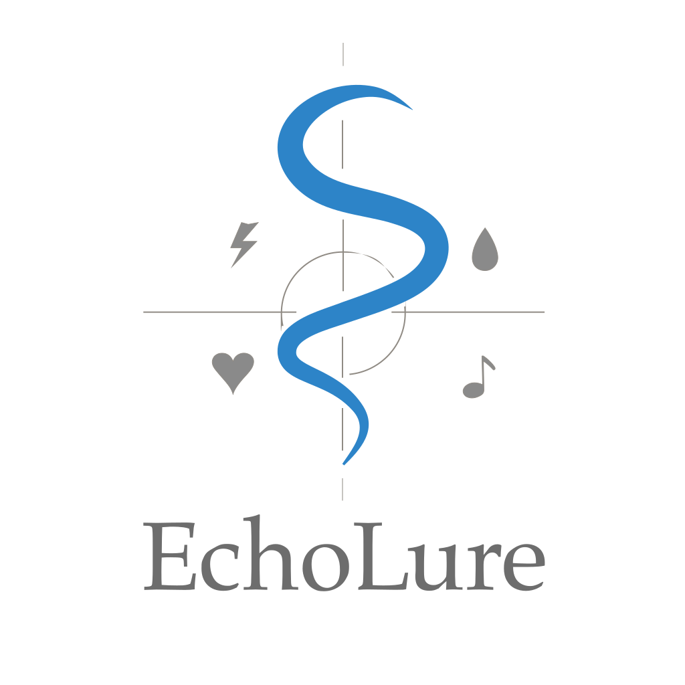

<p align="center">
  
</p>

# EchoLure Dev Library

A modular dev-first sound expression system. EchoLure lets you represent sensations, motions, emotions, and context using composable glyphs. These can then be interpreted as audio, animation, or haptic feedback — creating a multimodal design language.

---

## 📦 Installation

This project will eventually be available via npm. For now, you can clone the core library and use it locally:

```bash
git clone https://github.com/bonnieDev/echolure-core.git


# EchoLure Dev Library

A lightweight, expressive library for representing emotional and sensory glyphs in JavaScript.

# 🧪 How to Use

Import the library:

import EchoLure from 'echolure';

# Play a glyph with modifiers:
EchoLure.glyph('human-help')
  .pitch('low')
  .velocity('weak')
  .fall()
  .echo()
  .play();

# Play a basic glyph sound:
  EchoLure.playSound('heartbeat');

# Access all glyphs:
  const allGlyphs = EchoLure.all();

# Get similar glyphs:
  const similar = EchoLure.getSimilar('water-drip');

# 🛠️ What's Here So Far

    Glyph schema and seed data

    Placeholder media assets (audio + visuals)

    Component structure (React)

    Planning docs for future features

# 🚧 What’s Coming Soon

    Compass-based navigation UI

    User voting on glyph assets

    “Sounds like...” phonetic matching

    Accessibility-first interactions for both blind and deaf users